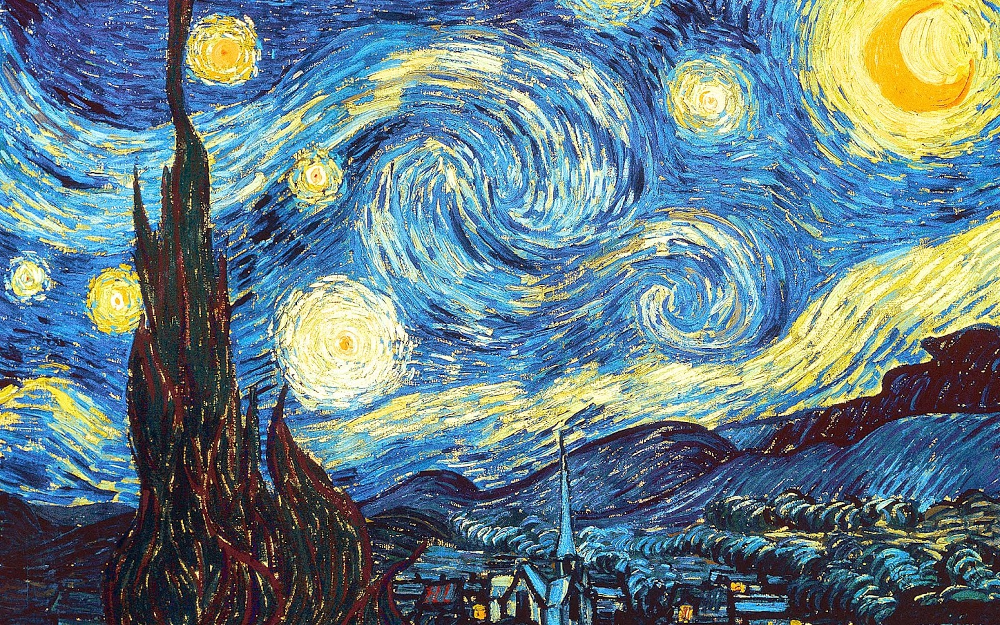
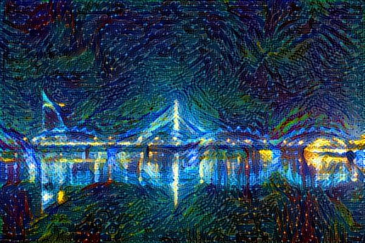
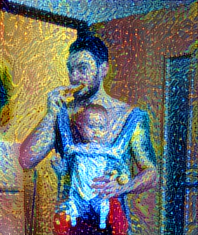

Algorithm initialy was described in https://arxiv.org/abs/1508.06576

Here's what the program will have to do:

    Create an Interactive Session [NEEDED IN CASE OF Keras?]
    Load the content image [DONE]
    Load the style image [DONE]
    Randomly initialize the image to be generated [DONE]
    Load the VGG19 model [DONE]
    Build the TensorFlow graph:
        Run the content image through the VGG19 model and compute the content cost [DONE]
        Run the style image through the VGG19 model and compute the style cost [DONE]
        Compute the total cost [DONE]
        Define the optimizer and the learning rate [DONE]

    Initialize the TensorFlow graph and run it for a large number of iterations, [IN TUNAGE]
    updating the generated image at every step.

## Some results 
### should be tuned

Style image of course van Gogh's "Starry Night":  

Style transfer result for Riga night panorama:

Style transfer result for me and my daughter:

